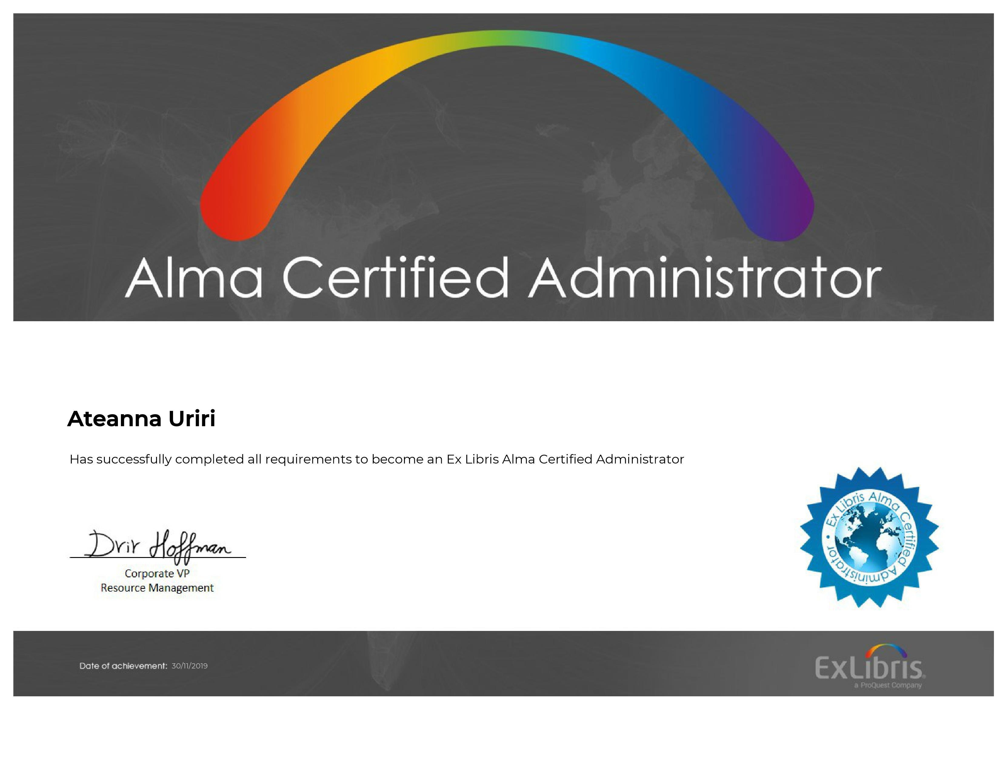
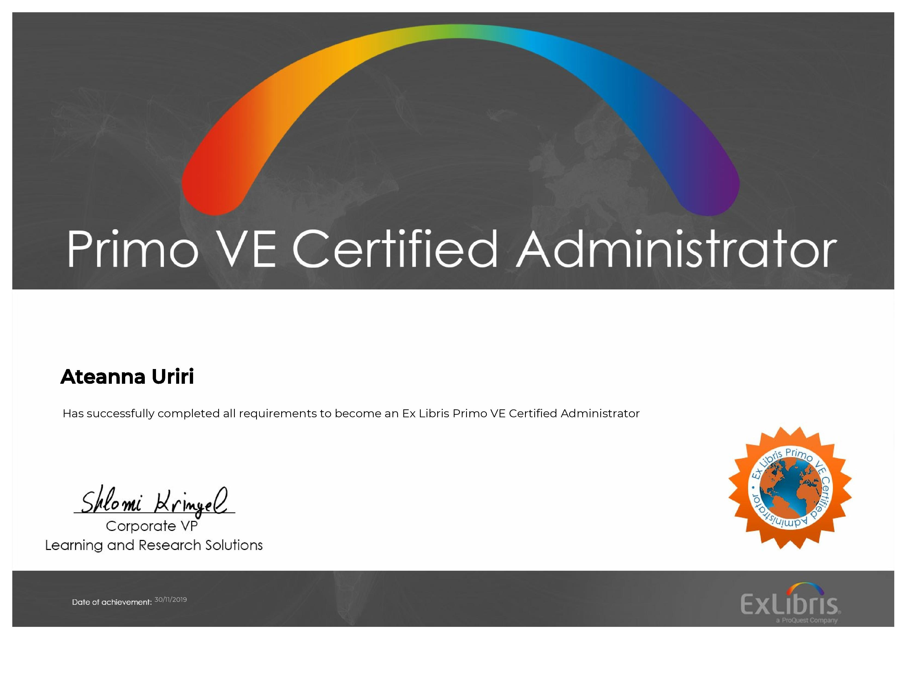
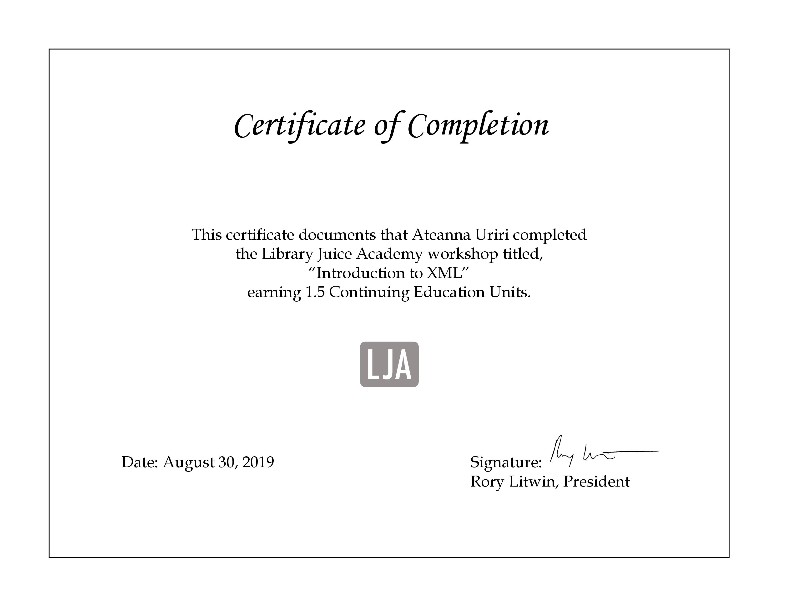
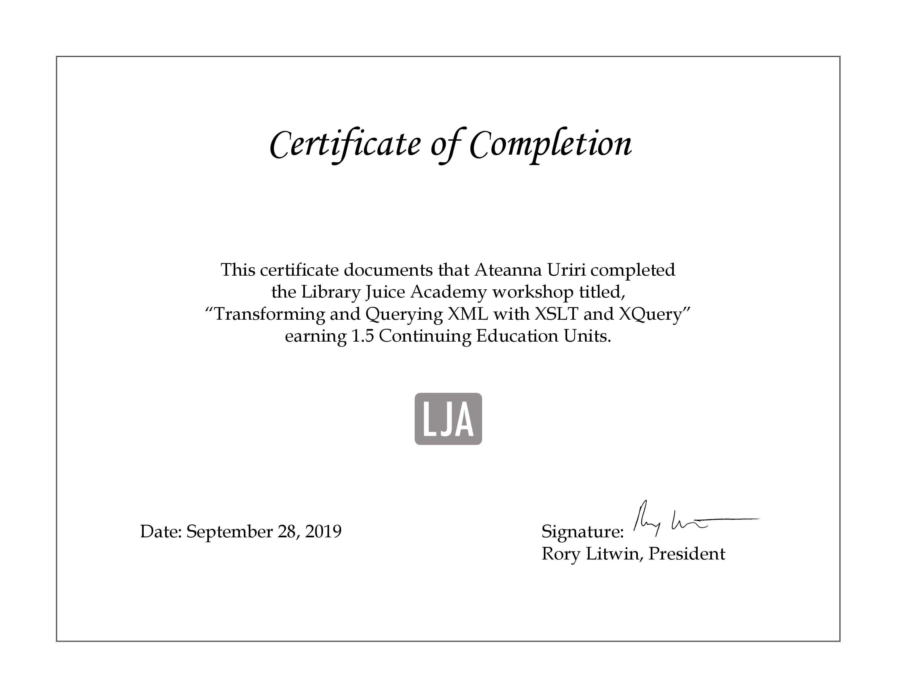
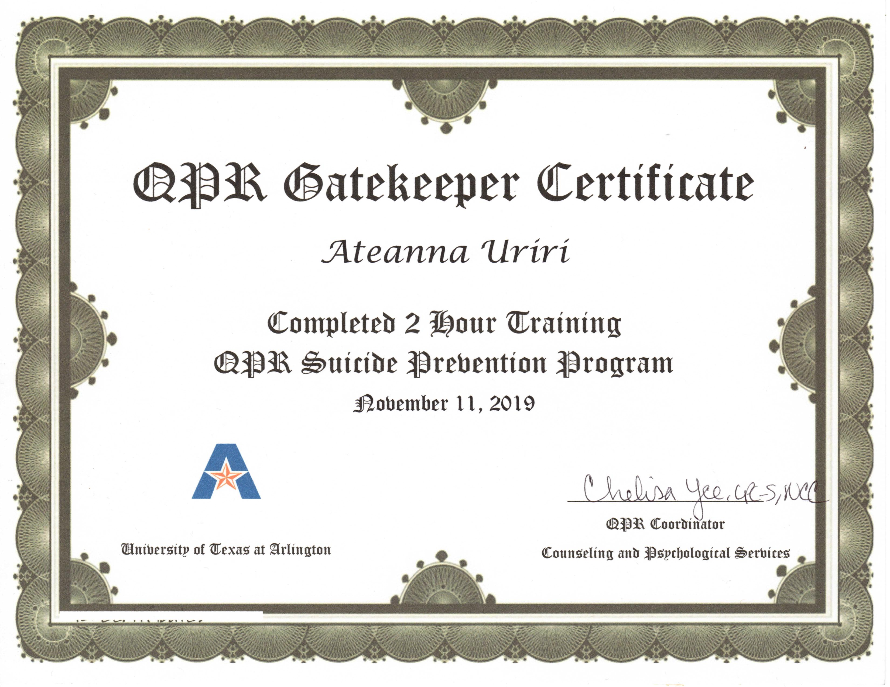

# Professional Development Certificates
### (also known as "proof I participated in/did a thing.")

Below are some of the certificates I've obtained from professional development courses and workshops. Where possible, I've included a link to information about the course, program, or workshop with which the certificate is associated.

### Alma & PrimoVE Administration Certification

[Alma Administration Certification](https://knowledge.exlibrisgroup.com/Alma/Training/Alma_Administration_Certification/01_Certification_Overview_Page)

[PrimoVE Administration Certification](https://knowledge.exlibrisgroup.com/Primo/Training/Primo_Training/Primo_Certification/00_Primo_Administration_Certification_Overview)

### [Certificate in XML & RDF-based Systems - Library Juice Academy](https://libraryjuiceacademy.com/certificate-xml-rdf.php)

[Introduction to XML](https://libraryjuiceacademy.com/019-intro-xml.php)

[Transforming and Querying XML with XSLT and XQuery](https://libraryjuiceacademy.com/052-querying-xml.php)

[SPARQL Fundamentals I](https://libraryjuiceacademy.com/055-SPARQL.php)

### University of Texas at Arlington-flavored Libraries Resilience Training

[Libraries Resilience Training (University of Pennsylvania)](https://ppc.sas.upenn.edu/services/penn-resilience-training)

### Question, Persuade, Refer (QPR) Gatekeeper Training

[QPR Gatekeeper Training](https://qprinstitute.com/organization-training)

[back](./)
